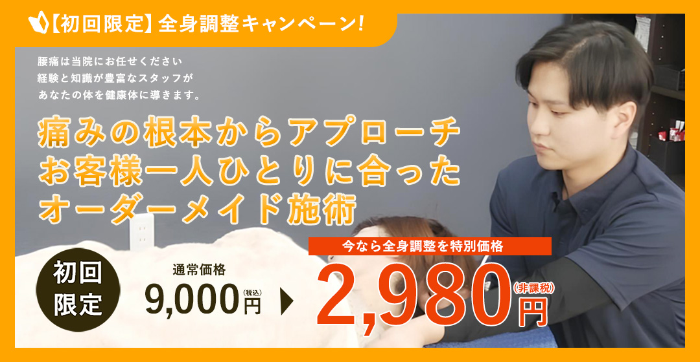
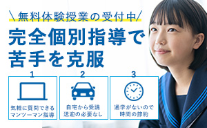
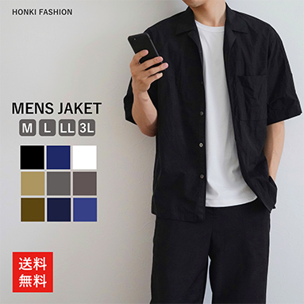
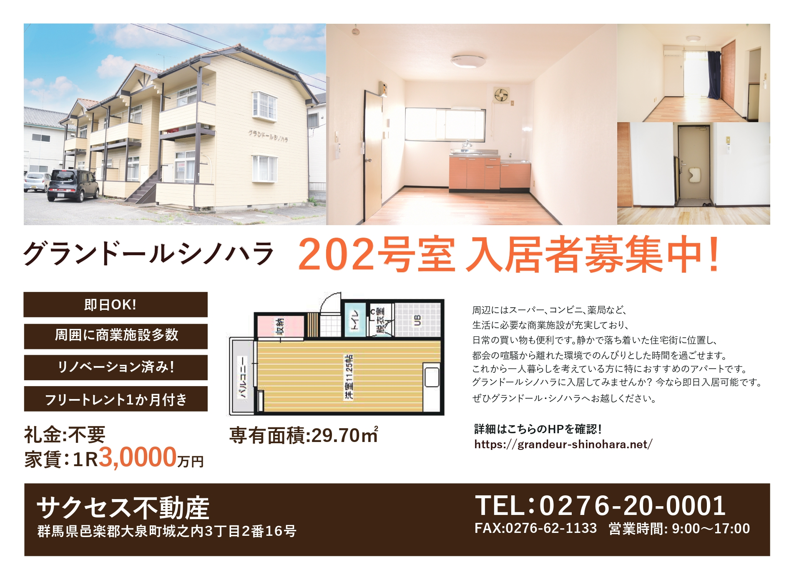

### バナー制作について

WebサイトやSNS広告において、ターゲット層の目を惹きつけ、クリックやコンバージョン（CV）へつなげるためのバナーデザイン集です。
単に装飾するだけでなく、「誰に・何を着眼点として伝えるか」という目的と文脈（ターゲット・媒体・配色心理）を明確にして制作しています。

---

### 制作実績一覧

#### 1. 整体院向けInstagram広告バナー（初回限定キャンペーン）

- **区分**: クライアントワーク（日の出整体院 様）
- **目的**: 初回限定キャンペーンの周知、認知拡大および新規予約の獲得（CVR向上）
- **ターゲット**: 腰痛・肩こりなど日常的な身体の悩みを抱える20代後半〜50代男女（整体初心者）
- **制作期間**: 1日間
- **使用ツール**: Photoshop

##### デザインのポイント

- **行動ハードルを下げる情報設計**: 「初回限定」のオファーと「2,980円」という特別価格を最大化して配置。タイポグラフィのサイズと配色にメリハリをつけ、タイムラインをスクロールする一瞬で魅力を伝える視認性を追求しました。
- **クライアント要望と安心感の両立**: ヒアリング時のご要望であった「アイボリーカラー」をベースに、温かみのある暖色（オレンジ）を組み合わせて展開。お店の親しみやすい雰囲気と安心感を演出しつつ、広告としてのアイキャッチ効果を高めました。

---

#### 2. 家庭教師マンツーマン体験講座バナー

- **区分**: 自主制作
- **目的**: 新規受講生（体験授業）の獲得・CVR向上
- **ターゲット**: 30代〜40代の保護者（主に小・中学生のお子様を持つ母親層）
- **制作期間**: 1日間
- **使用ツール**: Photoshop

##### デザインのポイント

- **安心感と誠実さを与えるカラーリング**: 信頼感や知性を印象付ける「濃いブルー」をメインカラーに採用。保護者が安心して相談できるトーン＆マナーに整えました。
- **視認性を高めたコピー配置**: 一番伝えたいタイトル見出しを大きく配置し、パッと見での可読性を最大限まで高めています。
- **イラストによるサービスイメージの補完**: マンツーマン指導の様子が直感的に伝わるイラストを配し、テキストを細かく読まなくても「個別指導の授業スタイル」が瞬時に理解できる工夫を施しました。

#### 3. 楽天向けレザージャケットEC商品バナー

- **区分**: 自主制作
- **目的**: 楽天市場内でのクリック率（CTR）および購買転換率（CVR）向上、新規売上の獲得
- **ターゲット**: 20代〜30代の男性（トレンドや実用性を重視する層）
- **制作期間**: 1日間
- **使用ツール**: Photoshop

##### デザインのポイント

- **一目でスペックが伝わる情報設計**: 着用モデル画像をダイナミックに配置して商品の魅力をアピールしつつ、展開カラーパレットと対応サイズをバナー内に明記。詳細ページへ遷移する前に疑問を解消し、ユーザーの離脱を防ぐUI配慮を行いました。
- **プラットフォームに最適化した視認性**: 楽天市場の賑わい感やモール特性を意識し、視線誘導を考慮したレイアウトとコントラストの高い配色で、サムネイルサイズでも高い視認性を確保しています。

### 1. 印刷媒体・ポスター / フライヤー

#### アパート入居者募集ポスター

- **区分**: クライアントワーク
- **目的**: 新規アパート入居者の獲得、物件認知の拡大・問い合わせ促進
- **掲載媒体**: 近隣飲食店での店舗掲示ポスター / ポスティング
- **ターゲット**: 20代〜50代男性（近隣エリアの飲食店を利用する単身層・一人暮らし検討層）
- **制作期間**: 1日間
- **使用ツール**: Photoshop / Illustrator

##### デザインのポイント

- **ロケーション（飲食店掲示）に配慮した視認性**: 飲食店の店内や店頭に掲示される状況を想定し、遠目からでも一目で「アパート入居者募集」だと認識できるよう、タイポグラフィとコントラストを意識して構成しました。
- **物件イメージと連動したカラーパレット**: アパート本体の外観カラーに合わせた「ホワイト × ブラウン」をベースに採用。落ち着きと安心感を表現しつつ、アクセントカラーの「オレンジ」で募集案内や問い合わせ先へ自然に視線を誘導しています。
- **単身男性に向けた情報設計**: 食事中や移動時の限られた時間でもポイント（清潔感・デザイン性・実用性）が瞬時に伝わるよう、無駄な装飾を削ぎ落としたスタイリッシュなレイアウトに仕上げました。
